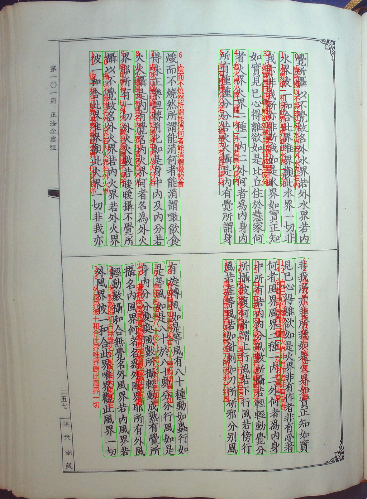
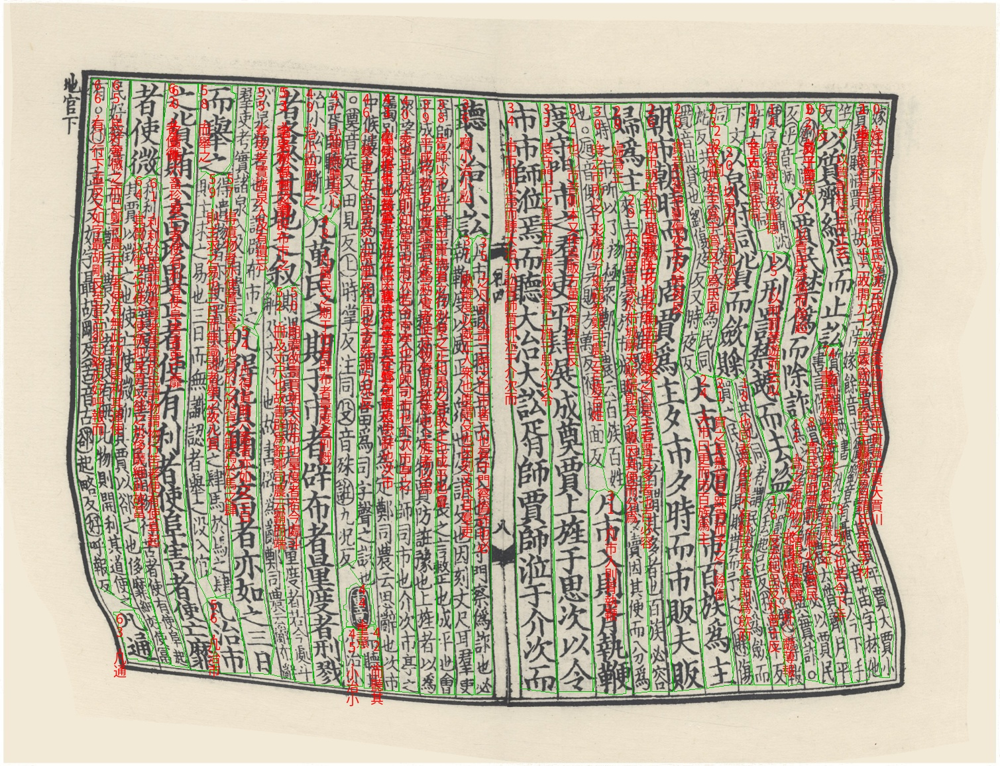

# AlphX-Code-For-DAR

## 粤港澳大湾区（黄埔）国际算法算例大赛-古籍文档图像识别与分析算法比赛 AlphX队源码

[[说明文档](https://docs.qq.com/doc/DWk9IZ2JYVnNyc0hM)] [[PPT展示](https://docs.qq.com/doc/DWk9IZ2JYVnNyc0hM)]


我国的古籍文献资料记录承载着丰富的历史信息和文化传承，为响应古籍文化遗产保护的相关国家战略需求，古籍数字化工作势在必行。由于古籍文档图像存在版式复杂多变、不同朝代的刻字书写风格差异大等问题，古籍文档图像的分析于识别仍极具挑战。本方案整合现有优秀模型，实现汉文古籍文档图像的分析与识别。利用PAN++网络检测任意形状的文本列对象，并结合编码解码网络与启发式算法实现复杂页面的阅读顺序预测。根据前景像素比例，结合霍夫变换与上边缘对齐算法实现高效的任意形状文本串图像的扭曲倾斜矫正。针对过长的文字序列图像，使用叠瓦识别策略避免过度压缩导致的信息损失。最后，使用改进的卷积循环神经网络实现文本字符串图像的端到端识别。本地实验结果表明，所提出的方案稳定可靠，鲁棒性较高，在保持较高准确率的同时维持了合理的推理速度。 


#### 识别结果






# 环境配置
## Modified from [Official Code of PAN++](https://github.com/whai362/pan_pp.pytorch)

First, clone the repository locally:

```shell
git clone https://github.com/ssocean/AlphX-Code-For-DAR.git
```

Then, install PyTorch 1.1.0+, torchvision 0.3.0+, and other requirements:

```shell
conda install pytorch torchvision -c pytorch
pip install -r requirement.txt
```

Finally, compile codes of post-processing:

```shell
# build pse and pa algorithms
sh ./compile.sh
```

# 训练

### PAN++训练
`
sh train_pan_pp/train.sh
`
### CRNN训练
`

`

### UNet训练

请参考[UNet](https://github.com/ssocean/UNet-Binarization)完成训练。

# 推理

`
sh infer.sh
`

# 文件说明

`main.py`是大赛要求的程序入口，我们做了本地化适配使其可以运行在本地环境上。

`TestModel.py` 是大赛要求的推理单张图像的脚本，我们在其中实现了两套方案（DeBUG|加速版本），您可根据需求更改`DEBUG`参数灵活切换推理模式。

`Infer_Utils.py`是我们为TestModel创建的辅助工具包，其内几乎实现了与单张推理有关的全部功能，包括行列投影、判断图像性质、图像矫正、叠瓦识别、启发式排序、全局顺序排序、模型定义等。


# 引用
如果您觉得我们的方案有一定帮助，请考虑引用如下工作~

### PAN++
```
@article{wang2021pan++,
  title={PAN++: Towards Efficient and Accurate End-to-End Spotting of Arbitrarily-Shaped Text},
  author={Wang, Wenhai and Xie, Enze and Li, Xiang and Liu, Xuebo and Liang, Ding and Zhibo, Yang and Lu, Tong and Shen, Chunhua},
  journal={IEEE Transactions on Pattern Analysis and Machine Intelligence},
  year={2021},
  publisher={IEEE}
}

```

```
赵鹏海. 乌金体藏文文档版面分析与识别系统[D].西北民族大学,2022.DOI:10.27408/d.cnki.gxmzc.2022.000367.
```

### 独立代码

[[叠瓦识别](https://github.com/ssocean/Overlapping-Recognition)]

[[二值化&全局顺序预测](https://github.com/ssocean/UNet-Binarization)]


### 如有疑问，请随时通过ISSUE与我们取得联系