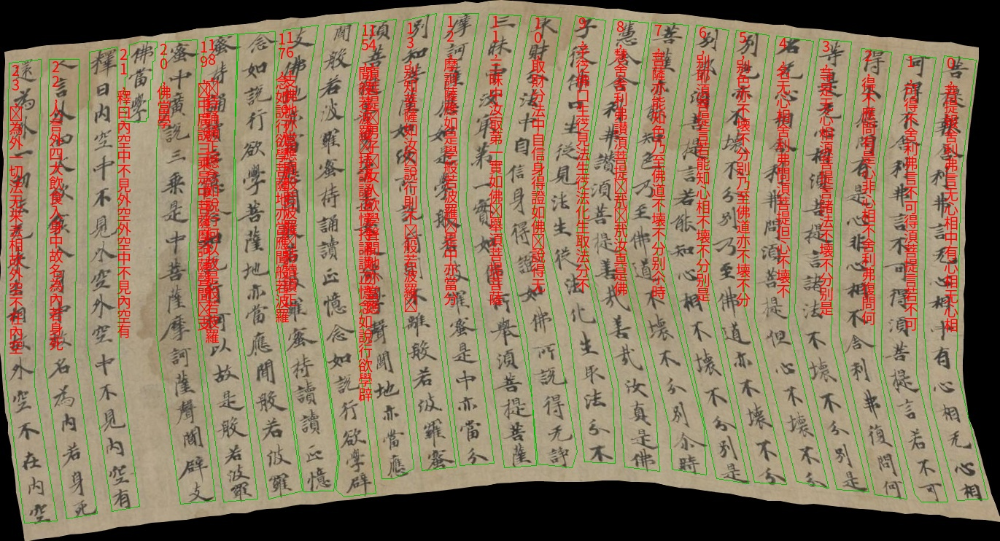

# AlphX-Code-For-DAR
## 粤港澳大湾区（黄埔）国际算法算例大赛-古籍文档图像识别与分析算法比赛 AlphX队源码
[[说明文档](https://docs.qq.com/doc/DWk9IZ2JYVnNyc0hM)] [[PPT展示](https://...)]


# 环境配置
`pip install -r requirements.txt`
# 训练
`
sh train.sh
`
# 推理
`
sh infer.sh
`
# 引用
请考虑引用如下工作
### PAN++
```
@article{wang2021pan++,
  title={PAN++: Towards Efficient and Accurate End-to-End Spotting of Arbitrarily-Shaped Text},
  author={Wang, Wenhai and Xie, Enze and Li, Xiang and Liu, Xuebo and Liang, Ding and Zhibo, Yang and Lu, Tong and Shen, Chunhua},
  journal={IEEE Transactions on Pattern Analysis and Machine Intelligence},
  year={2021},
  publisher={IEEE}
}
```
### 叠瓦识别策略
```
赵鹏海. 乌金体藏文文档版面分析与识别系统[D].西北民族大学,2022.DOI:10.27408/d.cnki.gxmzc.2022.000367.
```